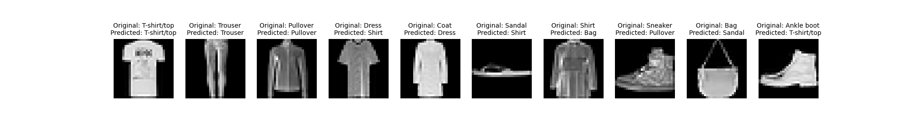

# Neural Networks from Scratch

A pure Python implementation of neural networks built from the ground up without using any deep learning frameworks. This project demonstrates a complete understanding of the fundamental components of neural networks by implementing them from first principles.

## Project Overview

This repository contains a fully functional neural network implementation built using only NumPy. All core components including layers, activations, loss functions, and optimizers are implemented from scratch to provide a deep understanding of how neural networks work internally.

## Features

- **Custom Neural Network Architecture**: Flexible layer-based architecture for building multi-layer perceptrons
- **Activation Functions**: Implementation of common activation functions (ReLU, Sigmoid, Softmax, etc.)
- **Loss Functions**: Various loss functions for different tasks (Cross-Entropy, MSE, etc.)
- **Optimization Algorithms**: Multiple optimizers for training (SGD, Adam, RMSprop, etc.)
- **Weight Initialization**: Proper weight and bias initialization strategies
- **Backpropagation**: Full implementation of backward pass for gradient computation
- **End-to-End Training**: Complete training pipeline with forward and backward propagation


## Getting Started

### Prerequisites

```bash
pip install numpy matplotlib
```

### Running Examples

#### MNIST Example
```bash
python ann_mnist_ex.py
```

#### Fashion-MNIST Example
```bash
python ann_fashion_mnist.py
```

#### Scikit-learn Dataset Example
```bash
python ann_sklearn_ex.py
```

## Core Components

### Neural Network Model (`ann_model.py`)
- Layer management and construction
- Forward propagation
- Backward propagation
- Training loop with mini-batch support

### Optimizers (`Optimizers.py`)
Implemented optimization algorithms:
- **SGD** (Stochastic Gradient Descent)
- **SGD with Momentum**
- **RMSprop**
- **Adam**
- **AdaGrad**

### Utilities (`utils.py`)
Helper functions for:
- Data preprocessing
- Visualization
- Performance metrics
- Data loading

## Example Results

The network has been successfully trained on:
- **MNIST**: Handwritten digit classification (0-9)
- **Fashion-MNIST**: Clothing item classification (10 classes)
- **Scikit-learn datasets**: Various toy datasets for testing

Sample predictions on Fashion-MNIST:



## 🛠️ Technical Implementation

### Forward Propagation
1. Linear transformation: `Z = W·X + b`
2. Activation function: `A = activation(Z)`
3. Repeat for each layer

### Backward Propagation
1. Compute loss gradient
2. Backpropagate through activation functions
3. Compute weight and bias gradients
4. Update parameters using optimizer

### Training Process
1. Initialize weights and biases
2. Forward pass through the network
3. Compute loss
4. Backward pass to compute gradients
5. Update weights using optimizer
6. Repeat for specified epochs

## Key Learnings

This project demonstrates:
- Deep understanding of neural network mathematics
- Implementation of automatic differentiation (backpropagation)
- Knowledge of optimization algorithms and their trade-offs
- Ability to build ML systems without relying on high-level frameworks

## Educational Purpose

This project is ideal for:
- Understanding the internals of deep learning frameworks
- Learning how backpropagation works in detail
- Studying different optimization algorithms
- Building intuition about neural network training dynamics

## Future Enhancements

Potential additions:
- Convolutional layers for image processing
- Recurrent layers for sequence data
- Batch normalization and dropout
- More advanced optimizers (AdamW, Nadam)
- GPU acceleration using CuPy
- Automatic differentiation engine